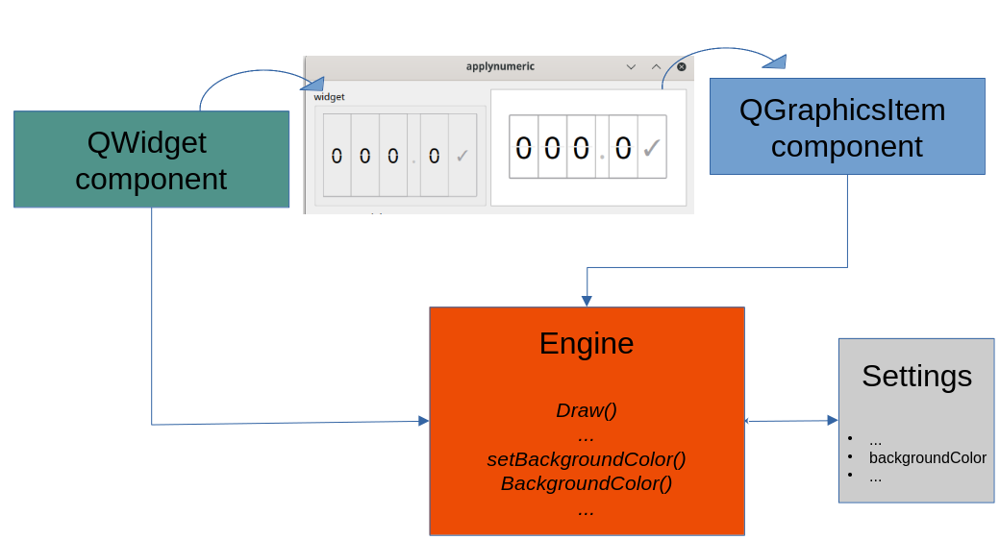
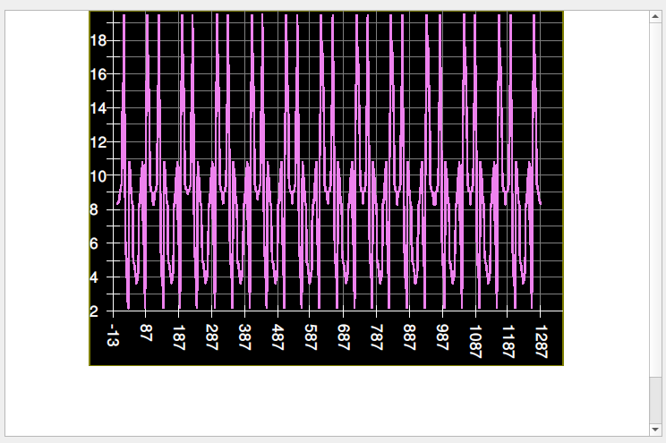
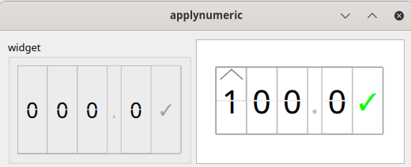
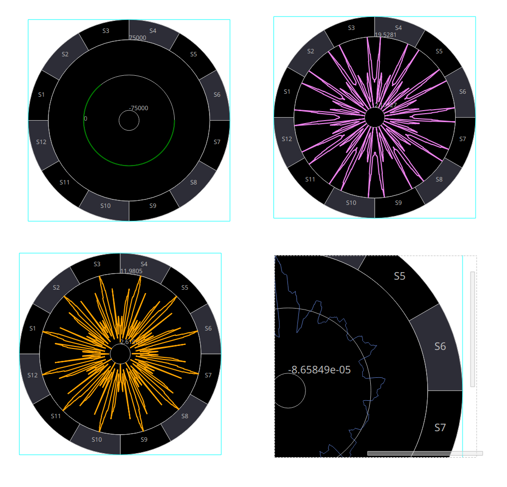

# new generation cumbia-qtcontrols

The new generation of *cumbia controls* focuses on the design of *high level software*, offering 
components for custom-tailored data visualization as well as for synoptic applications

## architecture

*cumbia-qtcontrols-ng* components shall be designed to be:

- scalable 
- integrated into SVG (see https://gitlab.com/ELETTRA-SincrotroneTrieste/qumbia-svg)
- highly customizable

QGraphicsItem components in a QGraphicsScene perfectly fit these requirements. Notwithstanding,
classical widget technology is supported. 
A common paint and configuration engine is shared between QWidget and QGraphicsItem implementations
of each component:

## components

### cartesian plots

#### quscalarplot and quarrayplot {#quplotsng}

Two implementations of *QwtPlot*, one tailored for scalar variables over time, the other for spectrum
data, offering substantially only two shortcuts, one for adding curves, one either for appending (scalar) 
or setting (array) data and a few signals on data updated, on error and on curve added.
Less than one hundred lines the array version and about 150 the scalar version, the implementations
are minimalistic in order to guarantee no overhead with respect to base QwtPlot and at the same time
ensure immediate debugging and benchmark comparison with QwtPlot.

The QuScalarPlot uses a *circular buffer* (QuCircularBuf) to store data. This means that the user must decide in 
advance how much data needs to be displayed on the chart. Convenience duration values, defined in
QuCircularBuf::Duration enum can be used to initialize the *scalar plots*.

The QuArrayPlot uses a QuArrayBuf buffer, that offers one method to *set* (copying) y data and one
to *move* y data, according to the needs of the client.
QuArrayPlot::setData uses the *move* semantics.

Additional functionality (i.e. curve search and selection, zooming and chart configuration) is added
by means of dedicated objects that can be *installed* on the plot. A list of relevant classes follows:

1. QuCurveSelector, access current curve selection or select a curve
2. QuPlotOptions, configure plot options (X and Y bounds, axes autoscale, openGL mode, ...)
3. QuCurveAccess, get the list of curves, find a curve by name, ...
4. QuPlotZoomer, zoom a plot area with the mouse
5. QuXTimeScale, install a time (with optional date) scale draw on the X axis

All the classes above require a pointer to the plot in the constructor.
Note that QuPlotOptions and QuCurveSelector can be local variables.

##### Methods

 The methods provided are limited in number, to ensure a minimalistic implementation.
 Compared with QwtPlot, they simply offer an easier interface to create curves and add
 data to them.
 QuScalarPlot::addCurve and QuArrayPlot::addCurve are used as a shortcut to add a new curve. 
 There are two flavours of QuScalarPlot::append for *scalar data*, to add data to a curve 
 with the given name, one QuArrayPlot::setData for *array plots*.
 A further a method is addressed at notifying the plot about an error occurred 
 while fetching data from the source (QuArrayPlot::onError and QuScalarPlot::onError).
 
 QuPlotDataConnector is an example of client. It reads from the sources and one of the 
 engines provided by *cumbia*, updates data and sets error conditions. An error is usually
 notified by a *tooltip*, which is cleared as soon as the condition is cleared.
 

##### Signals

 QuScalarPlot emits a few signals that can be used to detect the most relevant events:

 - curveAdded notifies a new curve has been added to the plot. Carries a pointer to the curve;
 - dataUpdated carries a pointer to the curve on which data has been updated
 - error notifies an error has occurred for the name of the source provided along with the
   message

##### OpenGL plots

QuArrayPlotGL and QuScalarPlotGL create OpenGL versions of the plots. You can also switch
the engine at runtime by means of QuPlotOptions.

##### Configuration

QuPlotOptions can be used to configure the plot (axes auto scale, bounds, openGL 
mode, ... )

#### qgraphicsplot (brought into cumbia-qtcontrols-ng from former qgraphicsplot lib)

The *qgraphicsplot*, formerly implemented in the namesake library, has become part of *cumbia-qtcontrols-ng*.
It offers a cartesian QGraphicsItem plot with its own zoomer along with the natural scaling of the items in 
a scene. See QGraphicsPlotItem.

### apply numeric

The QuNumericI is a QGraphicsObject that can be used to set a scalar value on a target
The QWidget counterpart looks and does exactly the same thanks to a common engine

### circular plots

Circular plots draw curves along a circular x axis and a radial y axis.
A QuCircularPlotEngine is used to store plot data and draw its contents.
The engine is common to both QWidget based and QGraphicsItem based implementations, namely
QuCircularPlotW and QuCircularPlotI.
According to the nature of your application and the preferred technology, both provide
identical behaviour through QuCircularPlotEngine.

QuCircularPlotEngine is itself a QObject rich in methods, signals and slots.
QuCircularPlotEngine stores the options of the plots (axis autoscale, bounds, colors)
through a dedicated structure named qucircularplot_attributes.
QuCircularPlotCurve represents a curve in the plot. There can be several curves in a single
plot. Each curve is identified by a name.

At the [ELETTRA synchrotron radiation facility](https://www.elettra.eu) circular plots are used to represent
values along the storage ring circumference. In the picture below, an additional *drawable* layer divides the
ring into the 12 sections that make up the ring.
